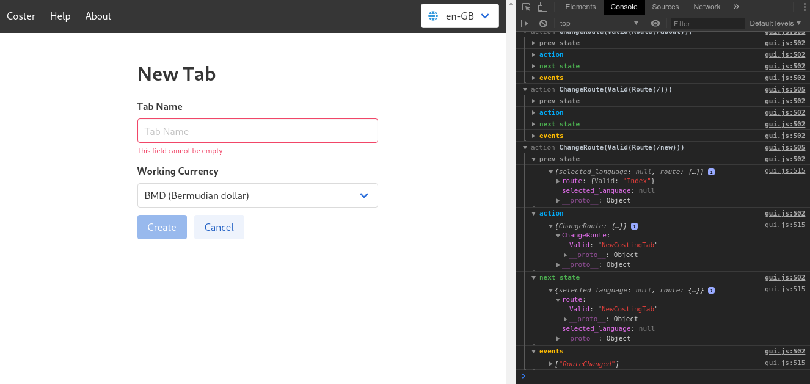

# yew-state (name wip)

This library is inspired by [redux](https://redux.js.org/), and
designed to be used within Rust GUI applications to have centralized
global state which behaves in a predictable way.

The behaviour of the system is customizable via middleware, and
provided in this library are a couple of examples, a simple logger,
and a web based logger inspired by
[redux-logger](https://github.com/LogRocket/redux-logger).

*Web Logger Middleware*
